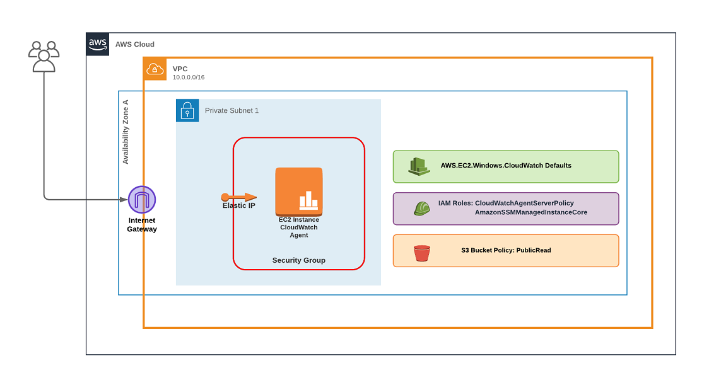

# EP5 - Azure Engineer Builds AWS Lab with Terraform

Let start with, if you came here to for AWS knowledge, expect very basic information but if you wanted to see what an Azure Engineer would do in AWS, keep watching!

As you know (or don't know), I work with Azure day to day! My knowledge and experience in AWS is lacking and I know basic concepts but have never deployed anything besides an EC2 Instance via the AWS console.

In my last episode [EP4 - Build an Azure Lab with Terraform](https://www.someoneelsescloud.com/episodes/ep4-build-an-azure-lab-with-terraform), I talk about the current industry trends about multi-cloud. And that learning a declaritive language like Hashicorp Configuration Language (HCL), could be beneficial and help bridge the gap to become cloud agnostic.

In this episode, I will use my Terraform skills and maybe some Googling to build an AWS Lab using Terraform and this is what I learnt!

## Prerequisites
- AWS Account
- Private and Public Key Pair

## Prepare your Environment
### 1. Create User Account for Terraform
- Create **User** Account with Role **AdministratorAccess**

*This is for demonstration purposes. Please assign the apprioriate roles you require for the resources you plan to deploy.

### 2. Configure Terraform AWS provider

- Configure the providers.tf file with the details that will be outputted from above.

### 3. Configure Public Key to access EC2 Instance

- Update the locals.tf and add your public key in the *public_key* value.

*Your Private Key should be in your default location (Windows is generally C:\Users\suername\.ssh\id_rsa)

## **Terraform Configuration Files: (after scratching my head from time to time)**

|Filename|Configuration|
|---|---|
|ec2.tf|AMI, Key Pair, EC2 (CloudWatch agent) and Elastic IP|
|iam.tf|IAM Roles for CloudWatch Agent and SSM|
|locals.tf|Random Name, Public Key and Regions|
|output.tf|Outputs Decrypted Administrator Password|
|providers.tf|Authentication, Region, AWS and Random Provider|
|s3.tf|S3 Bucket and PublicRead Policy|
|sg.tf|WinRM and Remote Desktop Security Group Rule|
|vpc.tf|VPC, Subnet, Internet Gateway and Route Table|

|Script Name|Link|
|---|---|
|[install-cloudwatchagent-windows-userdata.ps1](https://gist.github.com/it-am/4e353a0b3c70a48d4041d307f6fa8a61)|
|[CloudWatch Config EC2 Windows Sample](https://docs.aws.amazon.com/AmazonCloudWatch/latest/logs/QuickStartWindows2016.html#configure_cwl_download)|
|[Create IAM Roles and Users for Use with the CloudWatch Agent](https://docs.aws.amazon.com/AmazonCloudWatch/latest/monitoring/create-iam-roles-for-cloudwatch-agent.html)|

### **AWS Lab Overview**

Also note that you can copy the files and seperate them in folders to create multiple AWS environments!
All naming is generated, so the AWS environment can operate in parallel!

Hope you enjoy the Episode!

Direct YouTube link to this episode: [EP5 - Azure Engineer Builds an AWS Lab with Terraform](youtubelink)
Also video the website for all links and episodes: www.someoneelsescloud.com
